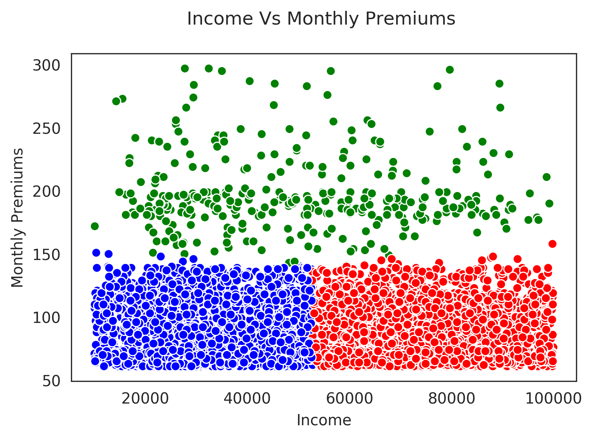

# An Overview Of A Clustering Project On Insurance Data

Hi there. This readme file provides an overview on a clustering project (for school) on insurance customers data. 

# Topics

* Scenario / Brief
* The Dataset
* Initial Seaborn Pair Plots
* Correlation Matrix
* Using Principal Component Analysis
* Investigative Scatterplots
* Clustering 
* Business Recommendation / Strategy

&nbsp;

# Scenario / Brief

An insurance company would like to know some information on its existing customers. The company would like to know who to try to upsell to.

&nbsp;

# The Dataset

The dataset from pulled the school's database. It contains 9134 rows / customers and is saved into a .csv file. Here are the column names in the dataset.

* Customer                         
* State                            
* Customer_Lifetime_Value          
* Response                       
* Coverage                         
* Education                        
* Effective_To_Date               
* EmploymentStatus               
* Gender                         
* Income                          
* Location_Code                   
* Marital_Status                  
* Monthly_Premium_Auto            
* Months_Since_Last_Claim         
* Months_Since_Policy_Inception   
* Number_of_Open_Complaints       
* Number_of_Policies              
* Policy_Type                     
* Policy                          
* Renew_Offer_Type                
* Sales_Channel                    
* Total_Claim_Amount               
* Vehicle_Class                   
* Vehicle_Size                    

---

It is not known about insurance product information, actual pricing of products, what the policy types are and what kind of cars the customers drive (i.e. Honda Civic, Volkswagen Gulf).

&nbsp;

# Initial Seaborn Pair Plots

With the use of seaborn's pairplot with `sns.pairplot()` we can see the relationship (correlation strength) between numerical variables. 

**Observations**

* Income seems to have little correlation on Total_Claim_Amount
* Low positive correlation from Customer Lifetime Value To Total Claim Amount
* Higher Monthly Premium auto payments leads to higher total claim amounts. But a large chunk are less than 150 / mth and less than 1200 for total claim amount.

---

* Higher Income does not mean higher monthly auto insurance expenses. (Could upsell to higher incomes)
* Seems to be at most a medium positive relationship between Monthly_Premium_Auto and Total_Claim_Amount.
* Higher monthly auto premiums leads to higher customer lifetime values (Medium + correlation).

&nbsp;

# Correlation Matrix

Instead of relying solely on an eye test with the pair plots for correlations, it is good to use the pair plots with a correlation matrix.

&nbsp;

# Using Principal Component Analysis

Principal component analysis (PCA) can be used to look at which features / variables contribute to each principal component (and to a target variable).

Note that a principal component is a line (linear combination) of all the variables.

**Some Insights From PCA**

Given that `Monthly_Premium_Auto` is the target variable.

`Total_Claim_Amount` is high in PC1.

`Customer_Lifetime_Value` appears in each of the first three principal components.

&nbsp;

# Investigative Scatterplots

From the PCA results, scatterplots can be utilized to take a look at the relationships of variable pairs. After trying out some variable pairs, I have settled with clustering data points from Income vs Monthly Premiums.

&nbsp;

# Clustering

From Income vs Monthly Premiums, multiple clustering methods have been tried. For more details, check the notebook.

* Hierarchical Clustering takes way too long on these 9134 customers.
* DBSCAN does not really give great looking clusters from what I've tried.
* Gaussian Mixture Models (GMMs) did not work well. 
* K-Means Clustering with three clusters (optimal) worked out really well. I saw a business strategy from this result.

&nbsp;

&nbsp;

# Business Recommendation / Strategy

&nbsp;

From the clustering, there is a higher income group that is paying the same monthly premiums as those in a lower income group. There is an opportunity to try to have these higher income customers pay more on monthly premiums. 

Within this target group, I have looked for any customers who have SUVs, sports cars or any luxury vehicles. These customers do have money to pay more for insurance. In addition, SUVs, sports cars and luxury vehicles are higher risks than regular sedans so it would make sense to raise insurance premiums. 

For existing customers, pricing adjustments have to be considerate. Aggressive sales tactics and pricing can lead existing customers to churn and possibly go to insurance competitors.
