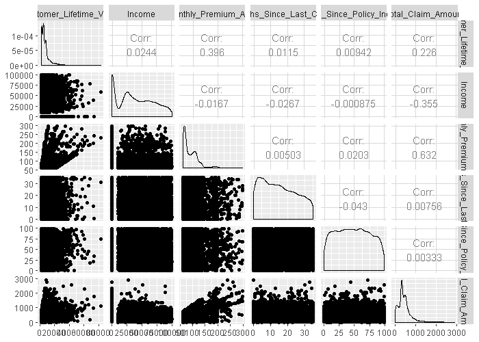
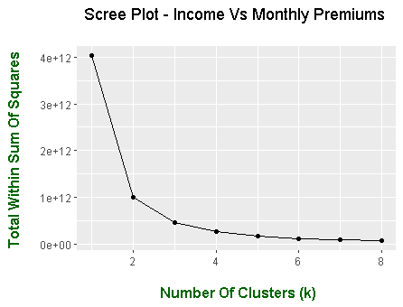
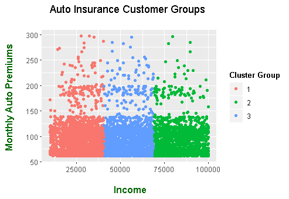

# An Overview Of A Clustering Project On Insurance Data With R Code

Hi there. This readme with R Code file provides an overview on a clustering project (for school) on insurance customers data. 

This README file is a different as this one deals with the R Code (in .R file).

# Topics

* Scenario / Brief
* The Dataset
* Pairplot With GGally
* Using Principal Component Analysis
* K-Means Clustering - Finding Optimal k Clusters
* K-Means Clustering On Auto Insurance Customers 

&nbsp;

# Scenario / Brief

An auto insurance company would like to know some information on its existing customers. The company would like to know who to try to upsell to.

&nbsp;

# The Dataset

The dataset from pulled the school's database with the use of Python & MySQL. It contains 9134 rows / customers and is saved into a .csv file. Here are the column names in the dataset.

* Customer                         
* State                            
* Customer_Lifetime_Value          
* Response                       
* Coverage                         
* Education                        
* Effective_To_Date               
* EmploymentStatus               
* Gender                         
* Income                          
* Location_Code                   
* Marital_Status                  
* Monthly_Premium_Auto            
* Months_Since_Last_Claim         
* Months_Since_Policy_Inception   
* Number_of_Open_Complaints       
* Number_of_Policies              
* Policy_Type                     
* Policy                          
* Renew_Offer_Type                
* Sales_Channel                    
* Total_Claim_Amount               
* Vehicle_Class                   
* Vehicle_Size             

&nbsp;

---

It is not known about insurance product information, actual pricing of products, what the policy types are and what kind of cars the customers drive (i.e. Honda Civic, Volkswagen Gulf).

&nbsp;

# Pairplot With GGally

To obtain pairplots (scatterplots) between numerical variables, the R package GGally is used.
Remember to use `install.packages("GGally")` for package installation and use `library(GGally)` to load in the package.

**Column Names In Pairplot**

The column names are hard to read. I did not have the columns become visisble. From top left to right, the columns are:

* Customer_Lifetime_Value
* Income
* Monthly_Auto_Premium
* Months_Since_Last_Claim
* Months_Since_Policy_Inception
* Total_Claim_Amount

&nbsp;

&nbsp;

**Observations**

* Income seems to have little correlation on Total_Claim_Amount
* Low positive correlation from Customer Lifetime Value To Total Claim Amount
* Higher Monthly Premium auto payments leads to higher total claim amounts. But a large chunk are less than 150 / mth and less than 1200 for total claim amount.

---

* Higher Income does not mean higher monthly auto insurance expenses. (Could upsell to higher incomes)
* Seems to be at most a medium positive relationship between Monthly_Premium_Auto and Total_Claim_Amount.
* Higher monthly auto premiums leads to higher customer lifetime values (Medium + correlation).

&nbsp;

# Using Principal Component Analysis

Principal component analysis (PCA) can be used to look at which features / variables contribute to each principal component (and to a target variable).

Note that a principal component is a line (linear combination) of all the variables.

**Some Insights From PCA**

* In the first principal component (PC1), Monthly Premium Auto, Total Claim Amount and then Customer Lifetime Value (CLV) are the top three variables.
* In PC2 it's Income, CLV, Monthly Premium Auto.
* In PC3, top variables are Months_Since_Last_Claim, Months_Since_Policy_Inception

&nbsp;

# Finding "Optimal" k Clusters

In this R version of code, I went with just K-Means clustering. I did not try DBScan, hierarchical clustering or Gaussian Mixture Models in R.

The image below shows that a good number of clusters would be three. Four clusters is another alternative.

&nbsp;

&nbsp;

# K-Means Clustering On Auto Insurance Customers 

&nbsp;

For clustering, the unemployed customers (Income = 0) has been removed. It is best not to upsell to these customers as they have no/little money. (Also, the insurance policies may be terminated if unable to pay regular premiums.)

The `kmeans()` function in R does clustering a bit differently that the Python sklearn version. R's clustering puts these three clusters in a horizontal fashion group by income levels when comparing Customer Income to Monthly Auto Premiums. (See image below)

&nbsp;

&nbsp;
